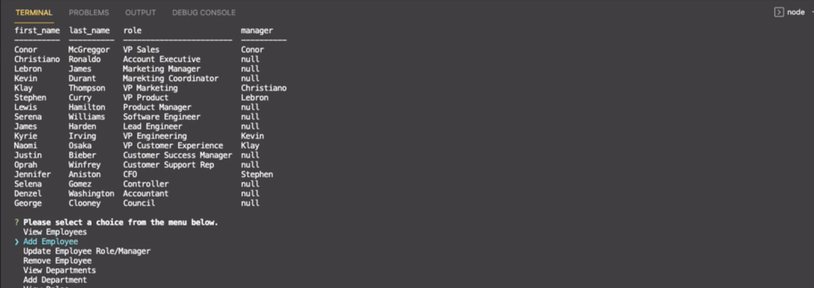

# Company HR Tracker

## Description

A command-line application that's used as a company HR tracker for managing employees, departments and roles using node, inquirer, and MySQL.

# Tech Used

- inquirer
- mySQL
- console.table
- Javascript
- Node.js

## Installation

1. Clone from GitHub
2. Open project directory, then npm install to install all required dependencies

## Usage

1. install npm init -y to create a new .json file
2. npm install
3. make sure to run each sql file in order of db, schema, and seeds
4. run node app
5. run through prompts as required

# Built With

Visual Studio Code - For the application code
 

# Working Application

- **[GitHub Repo](https://github.com/mjos7/employee-tracker)**
- **[Recorded Demo](https://www.loom.com/share/32ee93ce4e2b4c7c923ce8f902473a22)**

# License

MIT
